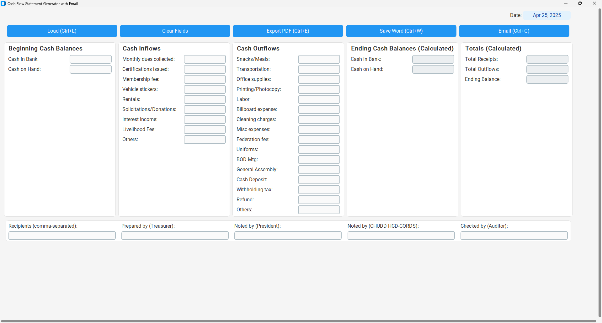

# HOA Cash Flow Statement Generator

A desktop application built with Python and CustomTkinter to help Homeowners Associations (HOAs) generate standardized cash flow statements. It allows for data entry, calculation, loading data from existing documents (DOCX/PDF), exporting to PDF and DOCX formats, and emailing the generated reports.


*(Replace `screenshot.png` with the actual path to a screenshot of your application)*

## Features

*   **Graphical User Interface:** Easy-to-use interface built with CustomTkinter for a modern look and feel.
*   **Data Entry:** Input fields for beginning balances, cash inflows, and cash outflows specific to HOA activities.
*   **Automatic Calculations:** Automatically calculates total receipts, total outflows, and ending cash balances (including breakdown).
*   **Data Formatting:** Input fields automatically format numbers with commas and two decimal places.
*   **Date Selection:** Includes a calendar popup (using `tkcalendar`) for easy date selection.
*   **Load from Document:** Import data from previously generated DOCX or PDF statements (attempts to parse based on expected labels).
*   **Export Reports:**
    *   Export the cash flow statement to a professionally formatted PDF file (Folio size: 8.5" x 13").
    *   Save the cash flow statement as a Microsoft Word document (DOCX) with similar formatting.
*   **Email Functionality:** Send the generated PDF and DOCX files as email attachments directly from the application using a Gmail account.
*   **Tooltips:** Helpful hints appear when hovering over buttons and input fields.
*   **Keyboard Shortcuts:** Common actions like Load, Export, Save, and Email have keyboard shortcuts.
*   **Clear Fields:** Option to easily clear all input data.
*   **Standalone Executable:** Can be packaged into a single executable file using PyInstaller for distribution.

## Requirements

*   **Python:** 3.7 or higher recommended.
*   **Python Libraries:**
    *   `customtkinter`
    *   `tkcalendar` (Optional, but required for the calendar popup feature)
    *   `pdfplumber` (For reading data from PDF files)
    *   `python-docx` (For reading/writing DOCX files)
    *   `reportlab` (For generating PDF files)
    *   `pyinstaller` (Optional, for creating a standalone executable)

## Installation

1.  **Clone or Download:** Get the project files onto your local machine.
    ```bash
    git clone <your-repository-url> # If using Git
    cd <repository-directory>
    ```
    Or download the ZIP file and extract it.

2.  **Install Dependencies:**
    *   Navigate to the project directory in your terminal or command prompt.
    *   Create a `requirements.txt` file in the project directory with the following content:
        ```plaintext
        # requirements.txt
        customtkinter
        tkcalendar
        pdfplumber
        python-docx
        reportlab
        pyinstaller
        ```
        *(Remove `tkcalendar` if you don't need the popup. Remove `pyinstaller` if you don't need to build an executable).*
    *   Run the following command to install the required libraries into your Python environment:
        ```bash
        pip install -r requirements.txt
        ```
        *(Note: This installs packages globally or into your user site-packages if not using a virtual environment. Using a virtual environment is generally recommended for managing project dependencies to avoid conflicts.)*

## Configuration (Email)

The application uses Gmail (smtp.gmail.com) to send emails.

1.  **Gmail Account:** You need a Gmail account to use as the sender.
2.  **App Password:** **IMPORTANT:** For security reasons, Gmail requires you to use an "App Password" instead of your regular account password when logging in from applications like this.
    *   You need 2-Step Verification enabled on your Google Account.
    *   Go to your Google Account settings -> Security -> App passwords.
    *   Generate a new App Password (select "Mail" and "Other (Custom name)" - e.g., "HOA Cash Flow App").
    *   Google will provide a 16-character password. **Copy this password immediately** (you won't see it again).
3.  **Update Credentials in Code:**
    *   Open the `cash_flow_app.py` file (or potentially `email_sender.py` if refactored).
    *   Locate the `EmailSender` initialization section (around line 610 in `cash_flow_app.py` based on the provided code).
    *   **Replace the placeholder email and password:**
        ```python
        # WARNING: Hardcoded credentials - replace in production!
        sender_email = "your_sender_email@gmail.com" # <<< REPLACE THIS
        sender_app_password = "your_16_character_app_password" # <<< REPLACE THIS
        self.email_sender = EmailSender(...)
        ```
    *   **Security Note:** Hardcoding credentials directly in the code is **not recommended** for security. Consider using environment variables or a configuration file in a real-world scenario.

## Usage

1.  **Run the Application:** Open your terminal or command prompt, navigate to the project directory, and run:
    ```bash
    python cash_flow_app.py
    ```

2.  **Select Date:** Click the "Select Date" button at the top right to choose the reporting period end date.
3.  **Enter Data:** Fill in the beginning balances, cash inflow amounts, and cash outflow amounts in the respective sections. Amounts will be formatted automatically.
4.  **Names & Recipients:** Enter the recipient email addresses (comma-separated) and the names for "Prepared by", "Noted by" (x2), and "Checked by".
5.  **Load Data (Optional):** Click "Load Doc" to select a previously saved DOCX or PDF statement. The application will attempt to parse and fill the fields. *Note: Parsing depends heavily on the document's structure matching the expected format.*
6.  **Review Calculations:** The "Ending Balances" and "Totals" sections update automatically as you enter data.
7.  **Export/Save:**
    *   Click "Export PDF" to save the statement as a PDF file.
    *   Click "Save Word" to save the statement as a DOCX file.
8.  **Email:** Click "Email Report" to send the generated PDF and DOCX files to the specified recipients using the configured Gmail account.
9.  **Clear:** Click "Clear Fields" to reset all input fields and names (confirmation required).

## Creating a Standalone Executable (using PyInstaller)

You can package the application into a single executable file (.exe on Windows, app bundle on macOS) so it can be run without installing Python or the dependencies on other machines.

1.  **Install PyInstaller:** Make sure it's installed (it should be if you followed the `requirements.txt` installation). If not:
    ```bash
    pip install pyinstaller
    ```

2.  **Run PyInstaller:** Open your terminal or command prompt, navigate to the project directory (where `cash_flow_app.py` is located), and run the following command:
    ```bash
    pyinstaller --name "HOACashFlowApp" --windowed --onefile cash_flow_app.py
    ```
    *   `--name "HOACashFlowApp"`: Sets the name of the executable and build folders.
    *   `--windowed`: Prevents a console window from opening when the GUI application runs.
    *   `--onefile`: Packages everything into a single executable file (can increase startup time). Alternatively, omit this to create a folder with the executable and its dependencies.
    *   `cash_flow_app.py`: The main script of your application.

3.  **Find the Executable:** PyInstaller will create a few folders (`build`, `dist`) and a `.spec` file. The final executable will be located inside the `dist` folder (e.g., `dist/HOACashFlowApp.exe` on Windows).

4.  **Distribution:** You can now distribute the executable file (or the entire `dist` folder if you didn't use `--onefile`) to other users.

**PyInstaller Notes:**

*   **Antivirus:** Sometimes, antivirus software might flag executables created by PyInstaller as suspicious (false positive). You might need to add an exception.
*   **Hidden Imports:** If the application fails to run after building, PyInstaller might have missed some hidden dependencies. You might need to edit the `.spec` file generated by PyInstaller to explicitly include them using the `hiddenimports=[]` list. For this application, the listed dependencies are usually handled well.
*   **Data Files:** If your application relied on external data files (like images or templates not included here), you would need to tell PyInstaller to include them using the `--add-data` flag or by modifying the `.spec` file.

## File Formats

*   **Input:** The "Load Doc" feature expects DOCX or PDF files that generally follow the label structure used within the application. Parsing accuracy may vary based on the source document's formatting.
*   **Output:**
    *   PDF: Formatted for Folio paper size (8.5" x 13").
    *   DOCX: Formatted Word document, also set up for Folio size.

## Keyboard Shortcuts

*   `Ctrl + L`: Load Document (PDF/DOCX)
*   `Ctrl + E`: Export to PDF
*   `Ctrl + W` / `Ctrl + S`: Save to Word (DOCX)
*   `Ctrl + G`: Send Email
*   `Ctrl + Q`: Quit Application

## Known Issues / Limitations

*   **Email Credentials:** Currently hardcoded in the source file (`cash_flow_app.py`). This is insecure. Use environment variables or a config file for better security.
*   **Document Parsing:** Loading data from DOCX/PDF is sensitive to the structure and exact labeling within the source documents. It might not work perfectly for all files.
*   **Ending Balance Calculation:** The breakdown of ending cash between "Bank" and "Hand" is based on a simplified calculation within the provided code. It might need adjustment based on specific HOA accounting practices.
*   **tkcalendar Dependency:** The calendar popup requires the `tkcalendar` library. If not installed, this feature will be unavailable, and an error message will appear upon clicking the date button.
*   **PyInstaller Build Size:** `--onefile` executables can be relatively large because they bundle Python and all dependencies.
*   **Global Package Installation:** Without a virtual environment, dependencies are installed globally or in the user site-packages, which can potentially lead to conflicts with other Python projects.

## Future Improvements

*   Implement secure credential management (environment variables, config file, or secure storage).
*   Improve robustness of DOCX/PDF parsing.
*   Allow customization of report templates/layout.
*   Add functionality to save/load the application's current state (all field values).
*   Implement unit tests.
*   Optimize PyInstaller build size if necessary.

## License

*(Specify your license here, e.g., MIT License, or state if it's proprietary)*
